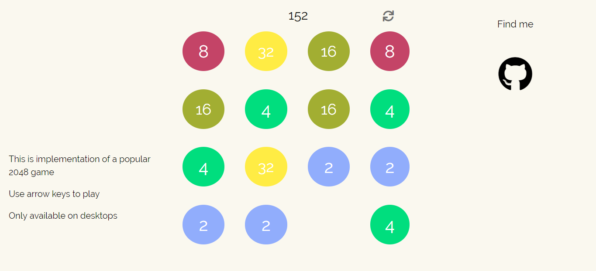

# 2048-vue

Simple recreation of popular 2048 game

## Technologies

* Javascript ES6
* Vue.js 2.x
* CSS3 (incl. grids)

## Demo

[TRY IT](https://piotrrussw.github.io/2048-vue/)

## Setup

You can just clone my repository.
If you want to play on older browser you
may use Javascript compiler like Babel, to 
convert ES6+ code into backwards compatible
version o Javascript

